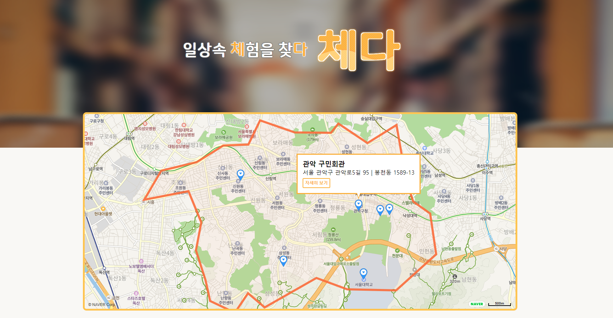
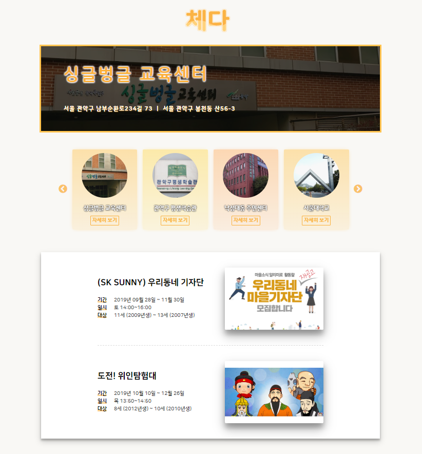
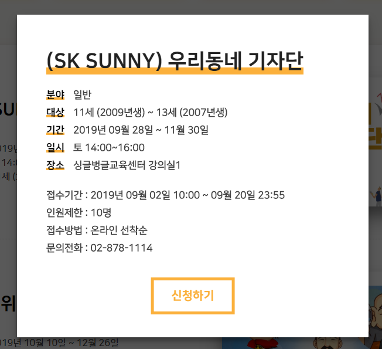

# ERICA_Cheda
체험을 찾다.<br/>
체다

한양대학교 ERICA 소프트웨어학부 오픈소스 소프트웨어 기초 팀과제<br/>
2019084984_임기성 #1PIut0<br/>
2019077183_이혜선 #2HyeseonLee<br/>


## Getting Started

### ✅ Prerequisites

Required | Description
--|--
[Ubuntu](https://ubuntu.com/) | 18.04 LTS
[Python](https://www.python.org/downloads/) | 3.6.8 or above 
[Django](https://www.djangoproject.com/) | 2.2.7 or above

### ✅ Installation
#### 0. Clone this git repository
```
https://github.com/PIut0/ERICA_Cheda.git
```
#### 1. Install python3, virtualenv
```
$ sudo apt install python3
$ sudo apt-get install python3-pip
$ sudo pip3 install virtualenvwrapper
```
#### 2. Create virtualenv
```
$ virtualenv venv
$ source venv/bin/activate
```
If all went well then your command line prompt should now start with (venv).
<!-- Django is installed in virtualenv. So you have to make python virtaul environment. Then activate it. -->

#### 3. Install Django
```
(venv)$ pip3 install django
```
#### 4. Migrate
```
(venv)$ cd Cheda
(venv)$ cd django_project
(venv)$ python manage.py migrate
```
#### 5. Start the server
```
(venv)$ python manage.py runserver
```
This will start the webserver on http://127.0.0.1:8000/


## Service Introduction

### ✅ Main_page


#### You can find a place for education in the area (Gwanak)
#### You can also use a map to find spot


### ✅ Info_page


#### You can choose a special education program for your place
#### Place list
* Single-buntle education center (싱글벙글 교육센터)
* Gwanak-gu Lifelong Learning Center (관악구 평생학습관)
* Nakseong Daedong Community Service Center (낙성대동 주민센터)
* Seoul National University (서울대학교)
* Mirim Girls' Information High School (미림여자 정보고등학교)
* Gwanak Community Center (관악 구민회관)


### ✅ Content_box


#### You can check the details here
#### You can apply for this program if you want.
